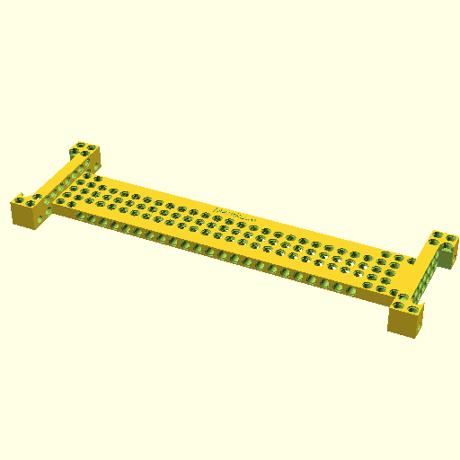

# PELA Autonomous Drift Car
## 3D Printed LEGO-compatible Parametric 1:10 Scale RC Drift Car Cover Based On [PELA Blocks](http://pelablocks.org)

A high-end RC drift car is modified with 3D printed PELA blocks, LEGO technics, a Raspberry Pi 3+ and camera to drive itself. Snap on additional sensors and custom body parts as your design evolves. At Futurice, we use this to compete and learn. Our different offices race each other to see who has the mad deep learning skills to drive the car around a track the fastest.

To install, get the last preview release of [OpenSCAD](https://www.openscad.org/) then:

`git clone git@github.com:LEGO-compatible-gadgets/PELA-drift-car.git --recurse-submodules`

**This drift car is a work in progress.** PELA Blocks and some imagination with LEGO technics will offer you all the parts you need and see here in the picture. Instructions are currently a bit thin as we iterate fast. We'll get to it. Promise.

This car has been designed to compete in [Markku.ai](https://markku.ai/). You can find more resources and ideas there. **Markku.ai** is a **Donkeycar**-derived autonomous driving competition based using high end 1:10 electric drift cars. If you're going to crah- do it with style.

Please see [donkeycar.com](http://www.donkeycar.com/) for help with the basic software setup. This car is a high performace, pimped-out version of what you find there.

## Models

[PELA Drift Car Center Beam](https://github.com/LEGO-compatible-gadgets/PELA-drift-car/blob/master/PELA-drift-car-center-beam.stl) A configurable mounting beam that can run down the top center of an RC car. This is the spine on which other modules are mounted. This makes future upgrades and field reconfiguration and repair easier using only technic pins rather than needing to design and print a new part each time. For smaller printers you may render this as two shorter sections that can be joined with two old LEGO technic beams you probably have laying around (or use [PELA technic beam](https://pelablocks.org)).

___

[PELA Drift Car Tamiya TT-02 End Connector](https://github.com/LEGO-compatible-gadgets/PELA-drift-car/blob/master/PELA-drift-car-tt02-end-connector.stl) An adapter for both ends of the Drift Car Center Beam. Two mounting holes at each end allow quick disconnect of the entire electronics beam from the donor Tamiya TT-02 1:10 RC drift car. The hole line up with the TT-02 body shell mount holes. You can use for example a technic beam with small holes drilled for cotter pins. Print two copies.

___

[PELA Raspberry Pi 3B Technic Mount](https://github.com/LEGO-compatible-gadgets/PELA-drift-car/blob/master/PELA-raspberry-pi3-technic-mount.stl) A Raspberry Pi 3B+ holder.

___

[PELA PCA9685 16 Channel Servo Board Technic Mount](https://github.com/LEGO-compatible-gadgets/PELA-drift-car/blob/master/PELA-pca9685-servo-board-technic-mount.stl) For holding a servo driver board to the center bar.

___

[PELA Raspberry Pi Camera Technic Mount](https://github.com/LEGO-compatible-gadgets/PELA-drift-car/blob/master/PELA-raspberry-pi3-camera-technic-mount.stl) A Raspberry Pi 3 camera holder.

___

[PELA Technic Bent Beam](https://github.com/LEGO-compatible-gadgets/PELA-drift-car/blob/master/PELA-technic-bent-beam.stl) This is **Option A** to mount the front camera to the front TT-02 End Connector at a 30 degree down angle. Print two copies and make two small holes in the shell.

___

[PELA Technic Block](https://github.com/LEGO-compatible-gadgets/PELA-drift-car/blob/master/PELA-technic-block.stl) This is part 1/2 of **Option B** to attach the front camera such that it easily breaks free in an accident. You can also use technic parts and pins to attach it more securely to the TT-02 Front End Connector.

___

[PELA Technic Angle Connector](https://github.com/LEGO-compatible-gadgets/PELA-parametric-blocks/blob/master/technic-beam/PELA-technic-angle-connector.stl) This is part 2/2 of **Option B** to hold the camera at a 30 degree down angle with easy break away in accidents.

___

[PELA Panel Sign](https://github.com/LEGO-compatible-gadgets/PELA-parametric-blocks/blob/master/technic-beam/PELA-panel-sign.stl) A sign you can use to name and label your model.

## Downloading

If you prefer to avoid git, you can download the files instead.

1. Download and unzip **[PELA Drift Car](https://github.com/LEGO-Prototypes/PELA-drift-car/archive/master.zip)**
1. Download and unzip **[PELA Blocks](https://github.com/LEGO-Prototypes/PELA-blocks/archive/master.zip)** as a subdirectory inside the above (`PELA-robot-hand/PELA-blocks`)
1. **Calibrate** the models to your printer/filament/slicer/preferences (see below)

## Git Clone

1. `git clone git@github.com:LEGO-compatible-gadgets/PELA-drift-car.git --recurse-submodules`
1. **Calibrate** the models to your printer/filament/slicer/preferences (see below)
1. Before `git submodule update --remote` to get PELA Blocks project changes, you may want to [backup your print calibration files](http://pelablocks.org/#calibration-file-backup)

## Calibration

**IMPORTANT:** The STL models must be customized for your material, printer and slicer. First **[calibrate](http://pelablocks.org/#calibrate)** the PELA blocks for your printer to achieve a nice snap fit.

See also [Advanced Calibration](http://pelablocks.org/ADVANCED-CALIBRATION)

## Calibration File Backup

If you later update the PELA-blocks project to a newer version, you risk overwirting and loosing your calibration customizations. The simplest solution is to create a backup copy those settings.

1. `cd PELA-drift-car/PELA-Blocks`
1. `cp PELA-parameters.scad ../PELA-parameters-backup.scad`
1. `cp PELA-print-parameters.scad ../PELA-print-parameters-backup.scad`

## Use

Edit the [OpenSCAD](http://www.openscad.org/) files to generate different views such as one finger at a time.

Be patient, have a nice meal and a coffee, the models are complex and render slowly.

## License

**Creative Commons Attribution-ShareAlike 4.0 International License**

These designs are by PELA project contributors, not by the LEGO corporation. They are compatible with LEGO and similar blocks available from multiple manufacturers and online projects. The associated patents have expired. These designs are not identical to LEGO; they have been specially modified for easy 3D printing and offered in the spirit of open source collaborative innovation.

If what you want is available as injection molded plastic, buy it for the higher quality and durability. These model are helpful when you want something customized, a special color, an unusual material, and for replacement parts when you just can't wait.

## Open source design, Powered By Futurice

These open source designs are brought to you by [Futurice](http://futurice.com) and contributions from the community. Come work with the best.

The software needed is free and open source, [OpenSCAD](http://www.openscad.org/). You can probably learn it in less than an hour.

## Contact

Collaboration and pull requests are welcome: [Git Project](https://github.com/LEGO-Prototypes/PELA-drift-car)

paul.houghton@futurice.com ( **[Blog](https://medium.com/@paulhoughton)** - **[Twitter](https://twitter.com/mobile_rat)** )

If you like it, please tweet about us! 
